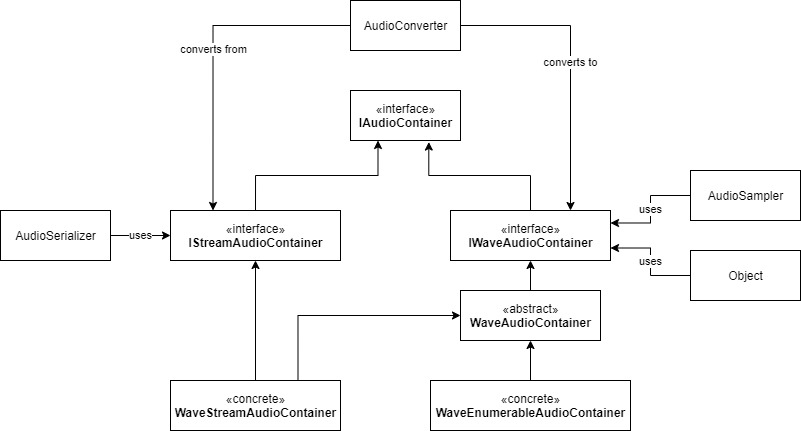
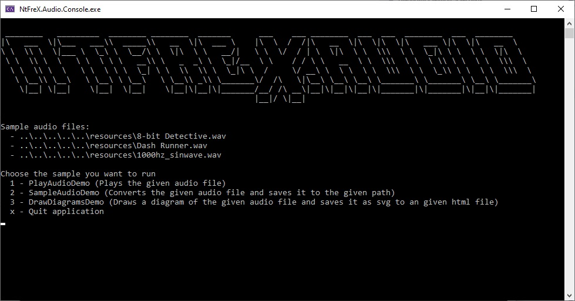

# NtFreX.Audio


This library provides functionality to read audio containers, sample wave pcm data, convert between audio formats and read/write wave pcm data.
The entry point should most of the be the `AudioEnvironment` class.

This is a takeout of the library architecture. A speciality of this library is the WaveEnumerableAudioContainer which allows you to create audio modification pipelines which do not allocate/copy the whole stream.



## Demo

For a demo look into the demo/NtFrex.Audio.Console project.



## Samples

**Read/Write an audio file**

```
var filePath = "myAudio.wave";
using IStreamAudioContainer audio = await AudioEnvironment.Serializer.FromFileAsync(filePath, cancellationToken);
if (audio is WaveStreamAudioContainer waveAudioContainer)
{
  // other audio types are currently not supported
  // it is planed to replace the if statement with a converter factory
}
```

Other methods which resolve/write an `IStreamAudioContainer` are:

 - AudioEnvironment.Serializer.FromDataAsync
 - AudioEnvironment.Serializer.FromStreamAsync
 - AudioEnvironment.Serializer.ToStreamSync
 - AudioEnvironment.Serializer.ToFileAsync
 - AudioEnvironment.Serializer.ToDataAsync

There are serval extension methods which make use of those methods.

**Audio sampling**

```
var newAudio = await AudioEnvironment.Sampler.SampleRateAudioSampler(WellKnownSampleRate.Hz44100).SampleAsync(audio, cancellationToken)
```

The sampler is not executed until the new audio is moved into an in memory container or written into another stream.
Other samplers are available under `AudioEnvironment.Sampler`.
Audio samplers can only be used with wave pcm data.

**Audio playback**

```
using var device = AudioEnvironment.Device.Get();
if (!device.TryInitialize(audio, out var supportedFormat))
{
   // an api to sample the audio automaticly is in planing
  audio = await new AudioSamplerPipe()
    .Add(x => x.BitsPerSampleAudioSampler(supportedFormat.BitsPerSample))
    .Add(x => x.SampleRateAudioSampler(supportedFormat.SampleRate))
    .RunAsync(toPlay, cancellationToken)

  if (!device.TryInitialize(audio, out _))
  {
    throw new Exception("Not supported");
  }
}

using var context = await device.PlayAsync(cancellationToken);
await context.EndOfDataReached.WaitForNextEvent();
```

## TODO

 - [ ] tests
 - [ ] api refinement
 - [ ] Wave audio container
   - [x] basis
   - [x] streamable
   - [x] enumerable
   - [ ] options
 - [ ] Wave audio samplers
   - [x] basis
   - [ ] bits per sample
   - [ ] sample rate
   - [ ] volume
   - [ ] volume normalization
   - [ ] background noise filter
   - [ ] speed
   - [ ] channels
   - [ ] fourier
 - [ ] audio devices
   - [x] basis
   - [ ] windows multi media
   - [ ] pulse audio (ALSA?)
 - [ ] audio playback
   - [x] basis
   - [ ] wasapi
     - [ ] channel mapping
   - [ ] pulse audio
 - [ ] audio recording
   - [ ] basis
   - [ ] wasapi
   - [ ] pulse audio
 - [ ] audio formats and containers
   - [ ] IEEE FLOAT
   - [ ] mp3 (https://docs.microsoft.com/en-us/windows/win32/medfound/windows-media-mp3-decoder)
 - [ ] audio converters
 - [ ] signal modification
   - [ ] generation
   - [ ] splitting
   - [ ] joining
 - [ ] ...
