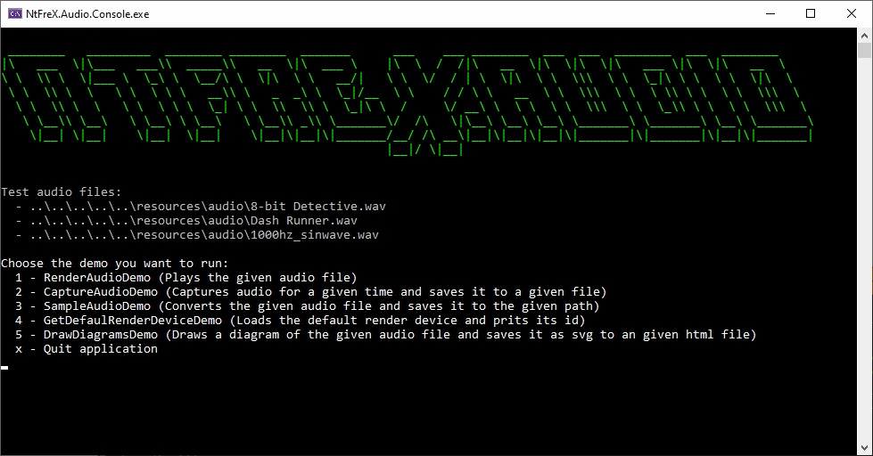
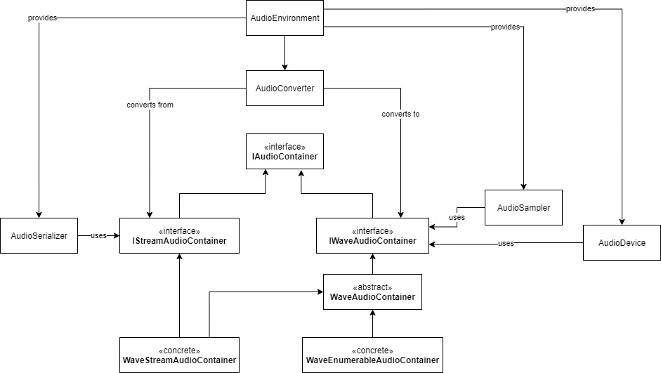

# NtFreX.Audio


This .net core library provides functionality to 

 - read audio containers
 - sample wave data
 - convert between audio formats
 - play/record wave data

## Supported formats

Containers/Formats:

 - Wave
   - Pcm (8bps, 16bps, 32bps, 64bps)
   - Float (16bps, 32bps, 64bps)

## Demo

For a demo look into the demo/NtFrex.Audio.Console project.



## Samples

**Read/Write an audio file**

```
var filePath = "myAudio.wave";
using IStreamAudioContainer audio = await AudioEnvironment.Serializer.FromFileAsync(filePath);

// other audio types are currently not supported
using var convertedAudio = AudioEnvironment.Converter.Convert<WaveStreamAudioContainer>(audio);
```

Other methods which resolve/write an `IStreamAudioContainer` are:

 - `AudioEnvironment.Serializer.FromDataAsync`
 - `AudioEnvironment.Serializer.FromStreamAsync`
 - `AudioEnvironment.Serializer.ToStreamAsync`
 - `AudioEnvironment.Serializer.ToFileAsync`
 - `AudioEnvironment.Serializer.ToDataAsync`

There are serval extension methods which make use of those methods. If you want to build your own container you can use the `WaveEnumerableAudioContainerBuilder`.

**Audio sampling**

```
var newAudio = await AudioEnvironment.Sampler
                                     .SampleRateAudioSampler(WellKnownSampleRate.Hz44100)
                                     .SampleAsync(audio, cancellationToken)
```

The sampler is not executed until the new audio is moved into an in memory container or written into another stream.
Other samplers are available under `AudioEnvironment.Sampler`.
Audio samplers can only be used with wave data.

Other samplers are:

 - `BitsPerSampleAudioSampler`
 - `SampleRateAudioSampler`
 - `ChannelAudioSampler`
 - `FromMonoAudioSampler`
 - `ToMonoAudioSampler`
 - `ShiftWaveAudioSampler`
 - `SpeedAudioSampler`
 - `VolumeAudioSampler`
 - `FloatToPcmAudioSampler`
 - `PcmToFloatAudioSampler`

**Audio render**

```
var audioPlatform = AudioEnvironment.Platform.Get();
using var device = audioPlatform.AudioDeviceFactory.GetDefaultRenderDevice();

await using var context = await device.RenderAsync(audio);

var totalLength = audio.GetLength().TotalSeconds;
context.PositionChanged.Subscribe((sender, args) => LogProgress(args.Value / totalLength));

await context.EndOfPositionReached.WaitForNextEvent();
```

**Audio capture**

```
var audioPlatform = AudioEnvironment.Platform.Get();
using var device = audioPlatform.AudioDeviceFactory.GetDefaultCaptureDevice();

var format = audioPlatform.AudioClientFactory.GetDefaultFormat(device);

await using var sink = await FileAudioSink.CreateAsync(file, format);

await using var context = await device.CaptureAsync(format, sink);

await Task.Delay(time);
```

## Installation

You need to install the `NtFreX.Audio` nuget package and then addtional nuget packages depending on the platforms you want to use.

 - For Windows 7 and upwards the `NtFreX.Audio.Wasapi` package

## Architecture
 
The entry point should most of the time be the `AudioEnvironment` class.

This is a takeout of the library architecture. A speciality of this library is the `WaveEnumerableAudioContainer` which allows you to create audio modification pipelines which do not allocate/copy the whole stream.


